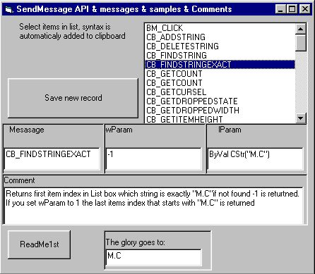



## Send message API & 50 samples

### Description

Database with 50 diferent constants, wParams, lParams and comments all together means examples. Please contribute to this as stated in Readme1st.

Have fun
 
### More Info
 

             |
---                |---
**Submitted On**   |2002-04-25 20:37:42
**By**             |[M\.C](https://github.com/Planet-Source-Code/PSCIndex/blob/master/ByAuthor/m-c.md)
**Level**          |Advanced
**User Rating**    |4.7 (14 globes from 3 users)
**Compatibility**  |VB 6\.0
**Category**       |[Windows API Call/ Explanation](https://github.com/Planet-Source-Code/PSCIndex/blob/master/ByCategory/windows-api-call-explanation__1-39.md)
**World**          |[Visual Basic](https://github.com/Planet-Source-Code/PSCIndex/blob/master/ByWorld/visual-basic.md)
**Archive File**   |[Send\_messa770224292002\.zip](https://github.com/Planet-Source-Code/m-c-send-message-api-50-samples__1-34216/archive/master.zip)

